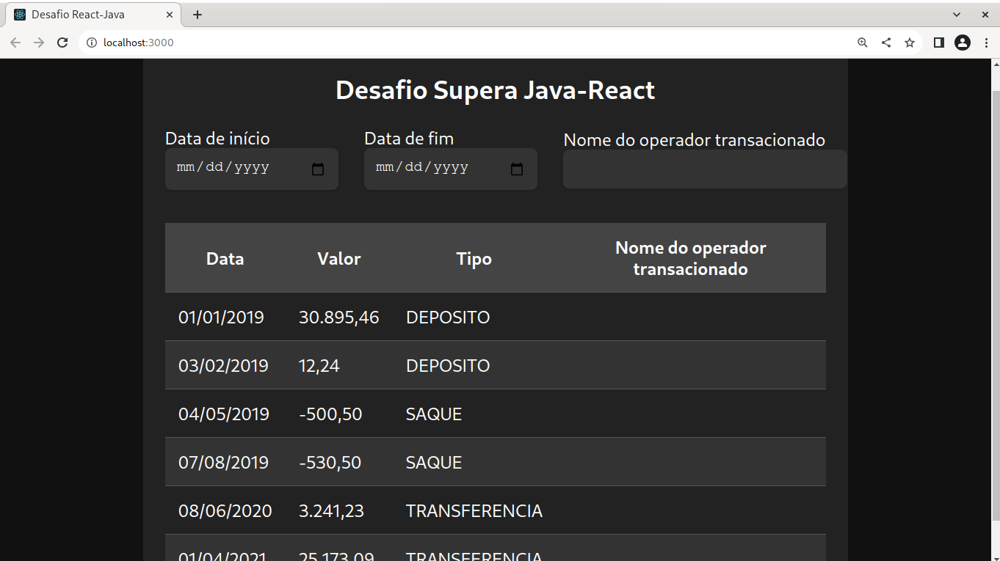

# Desafio Supera Java-React

Este projeto é uma avaliação para o processo seletivo da Supera em Java e React. Ele consiste em uma página web que exibe uma lista de transferências e permite filtrar as transferências por data de início, data de fim e nome do operador transacionado.

## Executando o projeto
Para executar o projeto, siga as etapas abaixo:

1. Certifique-se de ter o Node.js instalado em seu sistema.
2. Faça o clone deste repositório para o seu ambiente local.
3. Abra o terminal e navegue até o diretório raiz do projeto.
4. Execute o comando `npm install` para instalar as dependências do projeto.
5. Após a conclusão da instalação, execute o comando `npm start`.
6. O projeto será iniciado e estará disponível em [http://localhost:3000](http://localhost:3000) no seu navegador.

## Captura de tela
Aqui está uma captura de tela do projeto em execução:

## Funcionalidades
- Lista de transferências com data, valor, tipo e nome do operador transacionado.
- Filtros de pesquisa por data de início, data de fim e nome do operador.

## Tecnologias utilizadas
- React
- CSS